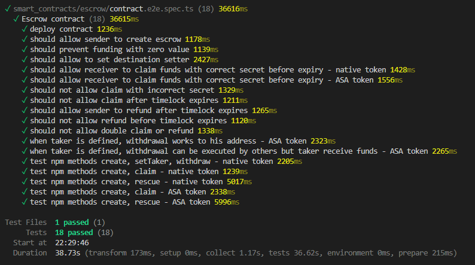

# Escrow

Project was created as production ready HTLC solution for AVM networks as part of ETH Global Prague hackathon.

https://ethglobal.com/events/prague/prizes/1inch

This is your workspace root. A `workspace` in AlgoKit is an orchestrated collection of standalone projects (backends, smart contracts, frontend apps and etc).

By default, `projects_root_path` parameter is set to `projects`. Which instructs AlgoKit CLI to create a new directory under `projects` directory when new project is instantiated via `algokit init` at the root of the workspace.

## Getting Started

To get started refer to `README.md` files in respective sub-projects in the `projects` directory.

Go to [Escrow README.md](projects/Escrow/README.md)

To learn more about algokit, visit [documentation](https://github.com/algorandfoundation/algokit-cli/blob/main/docs/algokit.md).
